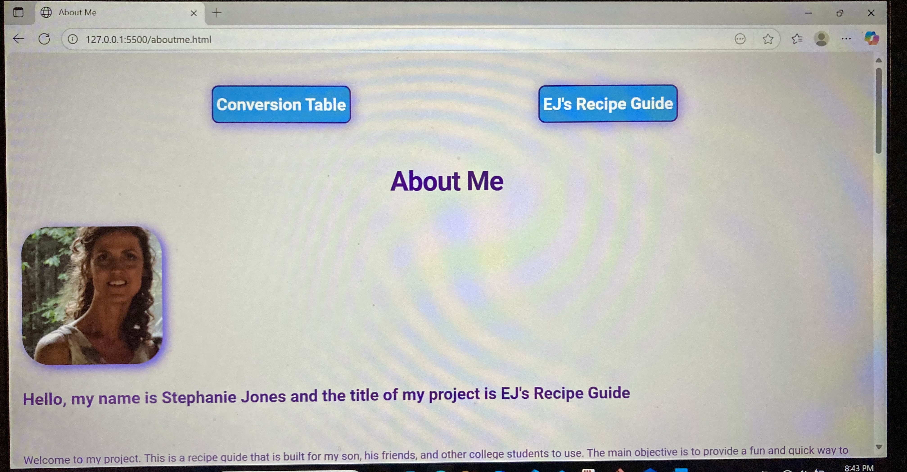
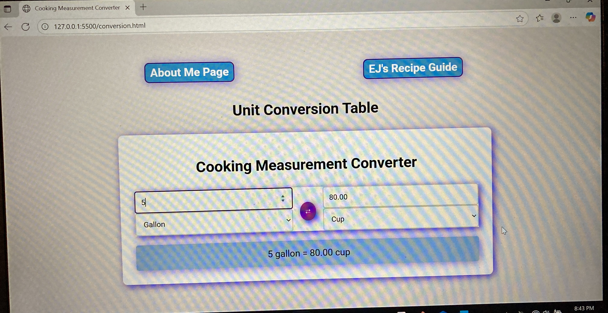
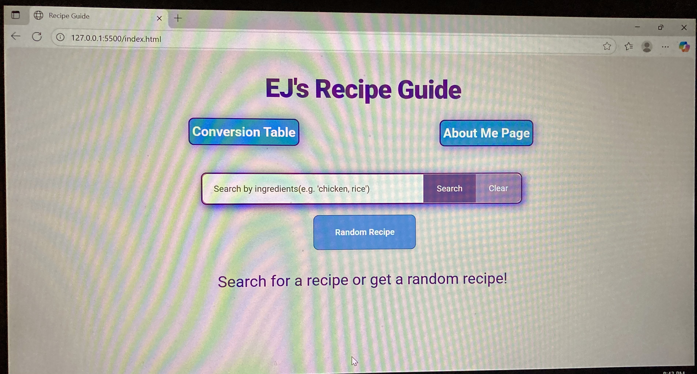

# Recipe-
# Title:
EJ's Recipe Guide

# Purpose:
Welcome to my project. This is a recipe guide that is built for my son, his friends, and other college students to use. The main objective is to provide a fun and quick way to list what ingredients that the user has available and then find a recipe based on those ingredients. The main objective of the project is to encourage my son and other students to be able to save money and possibly eat healthier but providing a way to use what they have available instead of eating out constantly. The css is designed in a way that will definitely appeal to my son, the HTML personalizes it for him to encourage usage, and the JavaScript works correctly to provide recipes based on ingredients that he inputs into the search bar or provides a random recipe if that is what he desires.

# Features required for the capstone:
1. Responsive: I used flex, grid and media queries for all three pages. examples are flex-grow: 1 which will allow the element to fill the available space within the flex container- which the available space will change with the size of the device. grid-template-columns: repeat(auto-fit, minmax(240px, 1fr)) was used on the recipe grid so this allows the cards to automatically to fill the columns that are provided to support as many cards as are pollulated and the size is a minimum or 240px but a maximum of 1fr-taking up the space available.
2. API Fetch :Makes a fetch api to mealsdb api for searching by ingredient and also for a random recipe.
3. 10 distinct commits- more than that was made and pushes were done through the terminal/command line
4. visually appealing- all pages are made with a completementing css style- using lots of purples and blues and css functions were implemented on each page.
5. I typed all code in word and did spell check.
6. text consistent across all pages- I installed google fonts- to ensure that the font was the same for all pages.
7. Analyze data that is stored in arrays, objects.... and display information about it in your app-  recipes.forEach((recipe) => {
    const recipeDiv = document.createElement("div");
    recipeDiv.classList.add("recipe-item");
    recipeDiv.dataset.id = recipe.idMeal;

    recipeDiv.innerHTML = `
        
        <h3>${recipe.strMeal}</h3>
    `;

    resultsGrid.appendChild(recipeDiv);
  });
is analying the array that is found as an object for each individual recipe and then transforming this into a recipe card
8. use a regular expression to validate user input and either prevent the invalid input or inform the user about it - any of the message functions would be an example of this, such as the following which will alert the user to that an input needs to be made in order for the website to search. This alson demonstrates code to prevent the default behavior so I can manipulate the data and the trim method eliminates white space making the search more efficient
searchForm.addEventListener("submit", (e) => {
  e.preventDefault();
  const searchTerm = searchInput.value.trim();

  if (searchTerm) {
    searchRecipes(searchTerm);
  } else {
    showMessage("Please enter the ingredients", true);
  }
});
9. visualize data is a user friendly way- production of the pop up recipe or modal would be an example of this. In order to populate this I had to use document.createElement 
 recipes.forEach((recipe) => {
    const recipeDiv = document.createElement("div");
    recipeDiv.classList.add("recipe-item");
    recipeDiv.dataset.id = recipe.idMeal;

    recipeDiv.innerHTML = `
        
        <h3>${recipe.strMeal}</h3>
    `;

    resultsGrid.appendChild(recipeDiv);
  })
  10. convert user input between two formats and display the result- The entire coversion table was built for this reason and to enhance user experience
  11. create a function that accepts two or more input parameters and returns a value that is calculated by the inputs. the async function is an example of this. the parameters are to show the message, false signfies an error which I established previously in the code, and true is for loading which again, I established previously in the code. The outcome is how the message is displayed. If it results in an error it will populate in a red block with a lighter shade of red for the text and loading will appear with a blue background and blue text
  async function getRandomRecipe() {
  showMessage("Finding a random recipe...", false, true);
  resultsGrid.innerHTML = "";

 
# Sources: 
I used several sources to help overcome challenges with this project, those include 
1. https://www.bing.com/videos/riverview/relatedvideo?&q=how+to+populate+a+recipe+card+with+html+css+and+javascript&&mid=2B363FF924CDABBD86BF2B363FF924CDABBD86BF&&FORM=VRDGAR
2. https://www.bing.com/videos/riverview/relatedvideo?&q=how+to+populate+a+recipe+card+with+html+css+and+javascript&&mid=D5741BA9FD2F3B126259D5741BA9FD2F3B126259&&FORM=VRDGAR
3. https://developer.mozilla.org/en-US/
4. https://www.w3schools.com/ 
5. https://www.youtube.com/watch?v=KWTyC1WKdFw&t=18263s 
6. https://stackoverflow.com/questions
7. https://forum.freecodecamp.org/t/build-a-recipe-page-build-a-recipe-page/731633
8. https://www.youtube.com/watch?v=x8EY0BlhPGk
9. https://www.youtube.com/watch?v=UnvsUEA71BA
10. https://www.youtube.com/watch?v=n33eOE5qViY
11. https://www.freecodecamp.org/news/creating-a-random-meal-generator/
12. https://www.youtube.com/watch?v=Y9TNHynFjaQ

# Future improvements
1. adding a favorites page
2. adding a build shopping list 
3. possibly linking to local stores to show the sale items that are listed on the shopping list 
4. adding a page for sharing original recipes of the users 

# Tools:
1. HTML
2. CSS
3. JavaScript

# To view the webpage
1. clone https://github.com/StephanieJones1015/Recipe-.git 
2. install Live Server if you do not have that extension in VS Code
3. click Go Live in the bottom right corner to view the page 

# Image!

Thank you for visiting my project. 